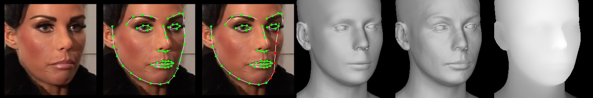

# 2주차

## 25.04.25


## 안면인식

### 1. 2D -> 3D

#### DECA 

Windows는 몇몇 종속성이 호환이 안되는 문제가 계속 발생하여 WSL로 구동하는 것으로 변경.

추후에 GPU 서버에서 구동하는 것으로 시도해볼 예정.


1. pyenv 설치
   ```bash
   # 종속성 설치
   sudo apt-get update
   sudo apt-get install -y make build-essential libssl-dev zlib1g-dev libbz2-dev \
   libreadline-dev libsqlite3-dev wget curl llvm libncurses5-dev libncursesw5-dev \
   xz-utils tk-dev liblzma-dev
   # pyenv 설치
   git clone https://github.com/pyenv/pyenv.git ~/.pyenv
   
   # 환경변수 설정 (zsh에선 zshrc)
   echo 'export PYENV_ROOT="$HOME/.pyenv"' >> ~/.bashrc
   echo 'export PATH="$PYENV_ROOT/bin:$PATH"' >> ~/.bashrc
   echo 'eval "$(pyenv init --path)"' >> ~/.bashrc
   echo 'eval "$(pyenv init -)"' >> ~/.bashrc
   source ~/.bashrc
   ```

2. 환경 세팅
   ```bash
   # pillow 설치 위한 필수
   sudo apt-get update
   sudo apt-get install libjpeg-dev zlib1g-dev llvm-11-dev
   
   # /etc/enviornment에 추가
   LLVM_CONFIG="/usr/lib/llvm-11/bin/llvm-config"
   
   source /etc/environment
   
   git clone https://github.com/yfeng95/DECA.git
   cd DECA
   
   pyenv install 3.7.4
   python -m venv wslvenv
   source wslvenv/bin/activate
   # requirements는 환경세팅하면서 개인화된 리스트
   # 의존성 때문에 먼저 설치
   pip install numpy==1.20.3 typing_extensions==4.7.1 pillow==9.5.0
   
   pip install torch==1.13.1+cu117 torchvision==0.14.1+cu117 torchaudio==0.13.1 --extra-index-url https://download.pytorch.org/whl/cu117
   
   pip install -r requirements.txt
   
   pip install --upgrade pip setuptools==49.6.0 wheel
   
   sudo apt-get update
   sudo apt-get install -y build-essential cmake pkg-config libjpeg-dev libpng-dev libtiff-dev libavcodec-dev libavformat-dev libswscale-dev libv4l-dev libxvidcore-dev libx264-dev libgtk-3-dev libatlas-base-dev gfortran python3-dev
   
   pip install opencv-python==4.5.3.56
   pip install face-alignment==1.4.1
   ```

   ```bash
   # 기본 의존성 및 빌드 도구
   ninja==1.11.1.4
   filelock==3.12.2
   packaging==24.0
   portalocker==2.7.0
   colorama==0.4.6
   termcolor==2.3.0
   
   # 로우레벨 수학/과학 라이브러리
   llvmlite==0.36.0
   numba==0.53.1
   scipy==1.7.3
   
   # PyTorch 관련
   fvcore==0.1.5.post20221221
   iopath==0.1.10
   yacs==0.1.8
   
   # 이미지/비디오 처리
   imageio==2.31.2
   tifffile==2021.11.2
   PyWavelets==1.3.0
   scikit-image==0.19.3
   kornia==0.6.12
   chumpy==0.70
   
   # 웹 요청 및 파싱
   gdown==4.7.3
   beautifulsoup4==4.13.4
   soupsieve==2.4.1
   PySocks==1.7.1
   
   # 기타 유틸
   networkx==2.6.3
   tabulate==0.9.0
   six==1.17.0
   PyYAML==5.1.1
   tqdm==4.67.1
   importlib-metadata==6.7.0
   zipp==3.15.0
   
   ```

3. 데이터 초기화
   ```bash
   # 데이터 다운 전 설치
   sudo apt-get install wget
   pip install gdown
   
   ./fetch_data.sh
   gdown --id 1rp8kdyLPvErw2dTmqtjISRVvQLj6Yzje -O data/deca_model.tar
   cd data
   wget https://github.com/TimoBolkart/BFM_to_FLAME/blob/main/data/BFM_to_FLAME_corr.npz
   cd ..
   ```

   

- 필요한 파이썬 패키지 중 face_alignment 의 버전이 기존 레포에서 사용하던 버전보다 올라감에 따라(1.4.1로 변경) 코드 수정 필요

  - ```python
    # decalib/datasets/detectors.py
    self.model = face_alignment.FaceAlignment(face_alignment.LandmarksType._2D, flip_input=False)
    # 에서
    self.model = face_alignment.FaceAlignment(face_alignment.LandmarksType.TWO_D, flip_input=False)
    # 로 수정 필요
    ```


4. CUDA 설치에 이어 CuDNN 설치

   - https://developer.nvidia.com/rdp/cudnn-archive 에서 8.7.0 for CUDA 11.x 버전의 Ubuntu 11.04 x86_64 다운로드
   - 이때, 로그인 필요.
   - 이후 파일을 서버로 넘겨주고, 설치

   ```bash
   # git bash
   cd ~/Downloads
   wsl
   
   # or wsl
   cd /mnt/c/Users/<USERNAME>/Downloads
   
   # 설치
   sudo dpkg -i cudnn-local-repo-ubuntu2204-8.7.0.84_1.0-1_amd64.deb
   sudo cp /var/cudnn-local-repo-ubuntu2204-8.7.0.84/cudnn-*-keyring.gpg /usr/share/keyrings/
   sudo apt-get update
   sudo apt-get install libcudnn8=8.7.0.84-1+cuda11.8
   sudo apt-get install libcudnn8-dev=8.7.0.84-1+cuda11.8
   sudo apt-get install libcudnn8-samples=8.7.0.84-1+cuda11.8
   
   # CuDNN 심볼릭 링크 생성
   sudo ln -s /usr/lib/x86_64-linux-gnu/libcudnn.so.8.7.0 /usr/local/cuda-11.8/lib64/libcudnn.so.8
   sudo ln -s /usr/lib/x86_64-linux-gnu/libcudnn.so.8 /usr/local/cuda-11.8/lib64/libcudnn.so
   
   # 환경변수 추가
   nano ~/.bashrc  # .zshrc
   
   # 맨 밑에 작성
   export PATH=/usr/local/cuda-11.8/bin:$PATH
   export LD_LIBRARY_PATH=/usr/local/cuda-11.8/lib64:/usr/lib/x86_64-linux-gnu:$LD_LIBRARY_PATH
   
   # 설치 확인 
   cat /usr/include/x86_64-linux-gnu/cudnn_version_v8.h | grep CUDNN_MAJOR -A 2
   ls /usr/lib/x86_64-linux-gnu/libcudnn*
   
   # 라이브러리 캐시 업데이트
   sudo ldconfig
   ```

   

5. demo 실행

   ```bash
   python demos/demo_reconstruct.py -i TestSamples/examples --saveDepth True --saveObj True
   ```

   

6. 결과
   

 					원본  →  랜드마크 추출  →  3D 정렬  →  기본  →  디테일  →  깊이 시각화
 	
 	1. 2D 얼굴 원본 사진에서 얼굴의 랜드마크를 탐지하고 정밀화
 	2. 이를 바탕으로 3D 메쉬를 생성하고, 텍스쳐를 입혀 디테일을 반영
 	3. 깊이 시각화 마스크 생성, 3D 벡터 정보를 추출

