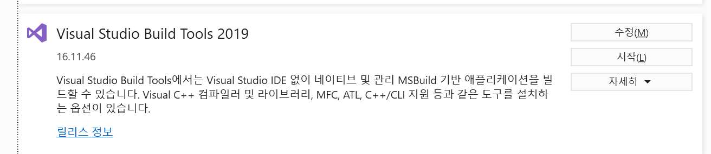
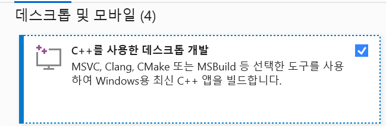
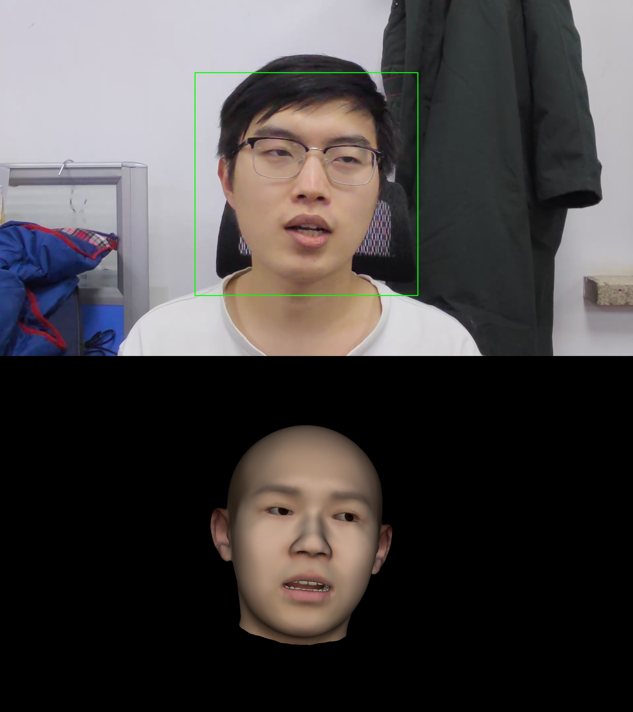

# 2주차

## 25.04.26


## 안면인식

### 1. 2D -> 3D (2)

#### FaceVerse (v4)

python 3.9 요구

아래 파일들 필요 - 클론받은 faceverse 레포 data 폴더에 넣기

- **FaceVerse version 4 model**: [[faceverse_v4_2.npy\]](https://1drv.ms/u/c/b8eab7b1820a6fa4/EWJOsgGxPMZDkl8xJ_QZB30BpcjNoMVGK9mnUPq5n9-lyw?e=4GvEs9)
- **FaceVerse version 4 network**: [[faceverse_resnet50.pth\]](https://1drv.ms/u/c/b8eab7b1820a6fa4/ETfT_C9Oz1FFlykJdtj3h6MBR1KvQb5BYwesxFykH-7BZA?e=7ti1yj)
- **mediapipe face_landmarker.task**: [[face_landmarker.task\]](https://storage.googleapis.com/mediapipe-models/face_landmarker/face_landmarker/float16/latest/face_landmarker.task)


1. FaceVerse 환경 설정
   ```bash
   git clone https://github.com/LizhenWangT/FaceVerse_v4.git faceverse
   cd faceverse
   # 파이썬 환경 설정
   pyenv install 3.9.8
   pyenv local 3.9.8
   
   python -m venv facevenv
   source facevenv/bin/activate  # facevenv/Scripts/activate
   
   # 종속 설치
   pip install -r requirements.txt
   
   # 셋업
   # 만약 윈도우라면 MSVC 설치 필요 - Visual Stdio 2019 build Tools에서 C++ 데스크톱 개발 설치
   cd Sim3DR
   python setup.py build_ext --inplace
   cd..
   ```

  윈도우와 리눅스 모두 셋팅할 수 있게 setup.py 파일 수정 해주었음
  ```python
  # Sim3DR/setup.py
  from distutils.core import setup, Extension
  from Cython.Build import cythonize
  from Cython.Distutils import build_ext
  import numpy
  import sys
  
  # Windows와 Ubuntu에 따라 다른 컴파일 옵션 적용
  if sys.platform == 'win32':
      extra_compile_args = ['/std:c++14', '/EHsc', '/MT']  # MSVC용 옵션
      include_dirs = [numpy.get_include(), 'C:\Program Files (x86)\Microsoft Visual Studio\2019\BuildTools\VC\Tools\MSVC\14.29.30133\bin\Hostx64\x64']
  else:
      extra_compile_args = ['-std=c++14']
      include_dirs = [numpy.get_include()]
  
  setup(
      name='Sim3DR_Cython',
      cmdclass={'build_ext': build_ext},
      ext_modules=[Extension(
          "Sim3DR_Cython",
          sources=["lib/rasterize.pyx", "lib/rasterize_kernel.cpp"],
          language='c++',
          include_dirs=include_dirs,
          extra_compile_args=extra_compile_args,
          extra_link_args=[],
      )],
  )
  ```

2. msvc 설치 (윈도우에서만)
   



- 설치 이후 `cl.exe` 파일 PATH에 등록
  시스템 - 고급 시스템 설정 - 환경변수 - 시스템 변수 - 새로만들기

  ```
  C:\Program Files (x86)\Microsoft Visual Studio\2019\BuildTools\VC\Tools\MSVC\{버전}\bin\Hostx64\x64
  ```

3. 테스트 코드 돌려보기
   ```bash
   python run.py --input example/input/test.jpg --output example/output --save_results True --smooth True --save_ply True
   ```

   

4. 결과

   

```bash
$ python run.py --input example/input/test.jpg --output example/output --save_results True --smooth True --save_ply True
Initialize FaceVerse_v4 data/faceverse_v4_2.npy
WARNING: All log messages before absl::InitializeLog() is called are written to STDERR
W0000 00:00:1745679234.347609   34508 face_landmarker_graph.cc:174] Sets FaceBlendshapesGraph acceleration to xnnpack by default.
INFO: Created TensorFlow Lite XNNPACK delegate for CPU.
W0000 00:00:1745679234.365974   15956 inference_feedback_manager.cc:114] Feedback manager requires a model with a single signature inference. Disabling support for feedback tensors.
W0000 00:00:1745679234.385320   33712 inference_feedback_manager.cc:114] Feedback manager requires a model with a single signature inference. Disabling support for feedback tensors.
Total running time: 0.8231 seconds
Done!
```

변환시간 0.82초 소요, 모델 로드하고 하는거 다 합치면 5초 정도 소요. DECA는 모델 로드하고 변환까지 1분 30여초 소요한 것에 비해 테스트 코드만 돌릴 땐 빠름.


텐서플로우 라이트로 돌려서 더 빠른 것으로 추정.

코드 분석하면서 더 빠르게 실행 할 수 있는지 또는 모델 로드 시켜놓고 돌릴 수 있는지 찾아볼 예정.

