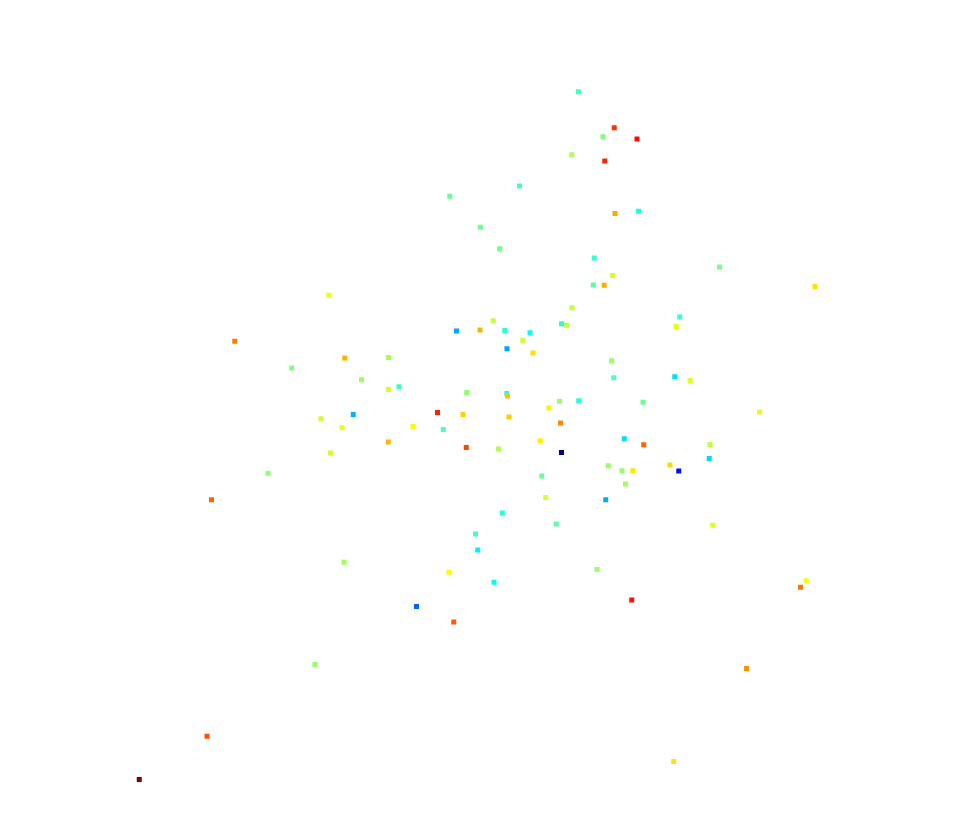

# 3주차

## 25.04.28


## 1. 안면인식

### 1. 2D -> 3D (3)

#### MICA

WSL2(Ubuntu 22.04)에 세팅

##### 1. conda 설치

```bash
wget https://repo.anaconda.com/archive/Anaconda3-2024.10-1-Linux-x86_64.sh

sh Anaconda3-2024.10-1-Linux-x86_64.sh

# bash(zsh)에 추가
export PATH=/home/ssafy/anaconda3/bin:$PATH

# 적용
source ~/.zshrc

# 설치 확인
conda --version
```

##### 2. MICA 세팅

```bash
git clone https://github.com/Zielon/MICA.git
cd MICA

# 개행문자 CRLF에서 LF로 변경 - Ubuntu에서 할 경우
sudo apt-get install dos2unix
dos2unix ./install.sh
dos2unix data/FLAME2020/FLAME_masks/FLAME_masks.pkl

# 설치
./install.sh

# 가상환경 활성화
conda activate MICA

# onnxruntime gpu사용으로 변경
pip uninstall onnxruntime
pip install onnxruntime-gpu==1.13.1

# 변경 확인
❯ python
>>> import onnxruntime as ort
>>> print(ort.get_available_providers())
['TensorrtExecutionProvider', 'CUDAExecutionProvider', 'CPUExecutionProvider']

# libtinfo.so.6 / libcuda.so 링크하기
nano ~/.bashrc  # .zshrc
```

```bash
export LD_LIBRARY_PATH=/usr/lib/wsl/lib:$LD_LIBRARY_PATH  # wsl에서의 libcuda 위치
export CUDA_HOME=$CONDA_PREFIX
export LD_LIBRARY_PATH=$CONDA_PREFIX/lib:$LD_LIBRARY_PATH
```

```bash
source ~/.bashrc  # .zshrc
```

##### 3. 실행

```bash
python demo.py
```

```bash
2025-04-28 15:25:18.941 | INFO     | models.flame:__init__:54 - [FLAME] creating the FLAME Decoder
2025-04-28 15:25:22.057 | INFO     | models.flame:__init__:54 - [FLAME] creating the FLAME Decoder
2025-04-28 15:25:22.355 | INFO     | micalib.models.mica:load_model:52 - [MICA] Trained model found. Path: /mnt/c/Users/SSAFY/Documents/fee/MICA/data/pretrained/mica.tar | GPU: cuda:0
Applied providers: ['CUDAExecutionProvider', 'CPUExecutionProvider'], with options: {'CPUExecutionProvider': {}, 'CUDAExecutionProvider': {'cudnn_conv_use_max_workspace': '0', 'enable_cuda_graph': '0', 'do_copy_in_default_stream': '1', 'arena_extend_strategy': 'kNextPowerOfTwo', 'cudnn_conv1d_pad_to_nc1d': '0', 'gpu_external_empty_cache': '0', 'gpu_external_free': '0', 'gpu_external_alloc': '0', 'gpu_mem_limit': '18446744073709551615', 'cudnn_conv_algo_search': 'EXHAUSTIVE', 'device_id': '0'}}
find model: /home/ssafy/.insightface/models/antelopev2/1k3d68.onnx landmark_3d_68 ['None', 3, 192, 192] 0.0 1.0
Applied providers: ['CUDAExecutionProvider', 'CPUExecutionProvider'], with options: {'CPUExecutionProvider': {}, 'CUDAExecutionProvider': {'cudnn_conv_use_max_workspace': '0', 'enable_cuda_graph': '0', 'do_copy_in_default_stream': '1', 'arena_extend_strategy': 'kNextPowerOfTwo', 'cudnn_conv1d_pad_to_nc1d': '0', 'gpu_external_empty_cache': '0', 'gpu_external_free': '0', 'gpu_external_alloc': '0', 'gpu_mem_limit': '18446744073709551615', 'cudnn_conv_algo_search': 'EXHAUSTIVE', 'device_id': '0'}}
find model: /home/ssafy/.insightface/models/antelopev2/2d106det.onnx landmark_2d_106 ['None', 3, 192, 192] 0.0 1.0
Applied providers: ['CUDAExecutionProvider', 'CPUExecutionProvider'], with options: {'CPUExecutionProvider': {}, 'CUDAExecutionProvider': {'cudnn_conv_use_max_workspace': '0', 'enable_cuda_graph': '0', 'do_copy_in_default_stream': '1', 'arena_extend_strategy': 'kNextPowerOfTwo', 'cudnn_conv1d_pad_to_nc1d': '0', 'gpu_external_empty_cache': '0', 'gpu_external_free': '0', 'gpu_external_alloc': '0', 'gpu_mem_limit': '18446744073709551615', 'cudnn_conv_algo_search': 'EXHAUSTIVE', 'device_id': '0'}}
find model: /home/ssafy/.insightface/models/antelopev2/genderage.onnx genderage ['None', 3, 96, 96] 0.0 1.0
Applied providers: ['CUDAExecutionProvider', 'CPUExecutionProvider'], with options: {'CPUExecutionProvider': {}, 'CUDAExecutionProvider': {'cudnn_conv_use_max_workspace': '0', 'enable_cuda_graph': '0', 'do_copy_in_default_stream': '1', 'arena_extend_strategy': 'kNextPowerOfTwo', 'cudnn_conv1d_pad_to_nc1d': '0', 'gpu_external_empty_cache': '0', 'gpu_external_free': '0', 'gpu_external_alloc': '0', 'gpu_mem_limit': '18446744073709551615', 'cudnn_conv_algo_search': 'EXHAUSTIVE', 'device_id': '0'}}
find model: /home/ssafy/.insightface/models/antelopev2/glintr100.onnx recognition ['None', 3, 112, 112] 127.5 127.5
Applied providers: ['CUDAExecutionProvider', 'CPUExecutionProvider'], with options: {'CPUExecutionProvider': {}, 'CUDAExecutionProvider': {'cudnn_conv_use_max_workspace': '0', 'enable_cuda_graph': '0', 'do_copy_in_default_stream': '1', 'arena_extend_strategy': 'kNextPowerOfTwo', 'cudnn_conv1d_pad_to_nc1d': '0', 'gpu_external_empty_cache': '0', 'gpu_external_free': '0', 'gpu_external_alloc': '0', 'gpu_mem_limit': '18446744073709551615', 'cudnn_conv_algo_search': 'EXHAUSTIVE', 'device_id': '0'}}
find model: /home/ssafy/.insightface/models/antelopev2/scrfd_10g_bnkps.onnx detection [1, 3, '?', '?'] 127.5 128.0
set det-size: (224, 224)
2025-04-28 15:25:28.769 | INFO     | utils.landmark_detector:__init__:47 - [DETECTOR] Selected RETINAFACE as landmark detector.
2025-04-28 15:25:28.770 | INFO     | __main__:main:119 - Processing has started...
100%|█████████████████████████████████████████████████████████████████████████████████████| 4/4 [00:03<00:00,  1.20it/s]
100%|█████████████████████████████████████████████████████████████████████████████████████| 4/4 [00:00<00:00,  6.49it/s]
2025-04-28 15:25:32.722 | INFO     | __main__:main:142 - Processing finished. Results has been saved in demo/output
```

GPU로 실행되는 것 확인

##### 4. 결과 확인

원본


```bash
# 결과파일 시각화 하기
pip install open3d
```

```python
# .ply 또는 .obj
import open3d as o3d

# .ply 또는 .obj 파일 읽기
mesh = o3d.io.read_triangle_mesh("경로/mesh.ply")
# mesh = o3d.io.read_triangle_mesh("경로/mesh.obj")

# 간단한 시각화
o3d.visualization.draw_geometries([mesh])
```


```python
# .npy
import open3d as o3d
import numpy as np

points = np.load("경로/identity.npy")

# 포인트클라우드로 변환
pcd = o3d.geometry.PointCloud()
pcd.points = o3d.utility.Vector3dVector(points)

# 시각화
o3d.visualization.draw_geometries([pcd])
```




