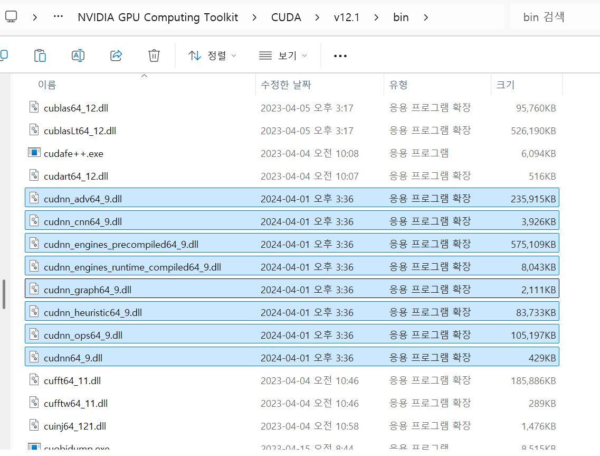
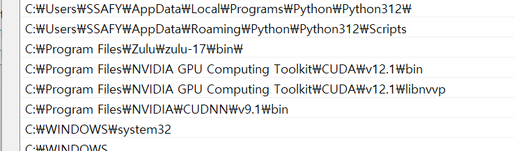

# 3주차

## 25.04.29


## 안면인식

### InsightFace 세팅

#### 사전 환경설정

| CUDA                | 12.1                                                         | 11.8        |
| ------------------- | ------------------------------------------------------------ | ----------- |
| **CuDNN**           | [**9.1.0**](https://developer.download.nvidia.com/compute/cudnn/9.1.0/local_installers/cudnn_9.1.0_windows.exe) | **8.7.0**   |
| **python**          | **3.10.11**                                                  | **3.10.16** |
| **onnxruntime-gpu** | **1.22.0.dev**                                               | **1.15.1**  |
| **numpy**           | **1.24.4**                                                   | **1.24.4**  |

버전이 조금이라도 틀리면 문제 발생함.

```bash
git clone https://github.com/deepinsight/insightface.git
cd insightface
```


Cuda의 bin 폴더에 CuDNN의 bin에 있는 dll 파일들 복붙해놓기 (Cuda의 bin폴더가 환경변수 등록 되어있어야 함)



CuDNN 환경변수 등록해놓기




1. Windows
   ```bash
   pyenv install 3.10.11
   pyenv local 3.10.11
   
   python -m venv invenv
   source invenv/Scripts/activate
   ```

   

2. WSL
   ```bash
   conda create -n insightface python=3.10
   conda activate insightface
   ```

   

```bash
pip install numpy==1.24.4 pillow flask flask-restx pycryptodome boto3 apscheduler
pip install opencv-python opencv-contrib-python
pip install insightface

# cuda 버전에 맞게 onnxruntime-gpu
# 12.1
python -m pip install onnxruntime-gpu --pre --extra-index-url=https://aiinfra.pkgs.visualstudio.com/PublicPackages/_packaging/ORT-Nightly/pypi/simple/

# 11.8
pip install onnxruntime-gpu==1.15.1
```


#### 설치 테스트

```python
Python 3.10.11 (tags/v3.10.11:7d4cc5a, Apr  5 2023, 00:38:17) [MSC v.1929 64 bit (AMD64)] on win32
Type "help", "copyright", "credits" or "license" for more information.
>>> import onnxruntime as ort
>>> print(ort.get_available_providers())
['TensorrtExecutionProvider', 'CUDAExecutionProvider', 'CPUExecutionProvider']
```


```python
from insightface.app import FaceAnalysis
from pathlib import Path

THIS_DIR = Path(__file__).parent
inface_models = THIS_DIR / "ComfyUI/models/insightface"
model = FaceAnalysis(name="buffalo_l", root=str(inface_models), providers=['CUDAExecutionProvider',])
model.prepare(ctx_id=0, det_size=(640, 640))
```


결과

```bash
❯ python test.py
download_path: /mnt/c/Users/SSAFY/Documents/fee/insightface/ComfyUI/models/insightface/models/buffalo_l
Downloading /mnt/c/Users/SSAFY/Documents/fee/insightface/ComfyUI/models/insightface/models/buffalo_l.zip from https://github.com/deepinsight/insightface/releases/download/v0.7/buffalo_l.zip...
100%|█████████████████████████████████████████████████████████████████████████| 281857/281857 [00:46<00:00, 6064.89KB/s]
Applied providers: ['CUDAExecutionProvider', 'CPUExecutionProvider'], with options: {'CPUExecutionProvider': {}, 'CUDAExecutionProvider': {'device_id': '0', 'gpu_mem_limit': '18446744073709551615', 'gpu_external_alloc': '0', 'gpu_external_free': '0', 'gpu_external_empty_cache': '0', 'cudnn_conv_algo_search': 'EXHAUSTIVE', 'cudnn_conv1d_pad_to_nc1d': '0', 'arena_extend_strategy': 'kNextPowerOfTwo', 'do_copy_in_default_stream': '1', 'enable_cuda_graph': '0', 'cudnn_conv_use_max_workspace': '1', 'tunable_op_enable': '0', 'enable_skip_layer_norm_strict_mode': '0', 'tunable_op_tuning_enable': '0'}}
find model: /mnt/c/Users/SSAFY/Documents/fee/insightface/ComfyUI/models/insightface/models/buffalo_l/1k3d68.onnx landmark_3d_68 ['None', 3, 192, 192] 0.0 1.0
Applied providers: ['CUDAExecutionProvider', 'CPUExecutionProvider'], with options: {'CPUExecutionProvider': {}, 'CUDAExecutionProvider': {'device_id': '0', 'gpu_mem_limit': '18446744073709551615', 'gpu_external_alloc': '0', 'gpu_external_free': '0', 'gpu_external_empty_cache': '0', 'cudnn_conv_algo_search': 'EXHAUSTIVE', 'cudnn_conv1d_pad_to_nc1d': '0', 'arena_extend_strategy': 'kNextPowerOfTwo', 'do_copy_in_default_stream': '1', 'enable_cuda_graph': '0', 'cudnn_conv_use_max_workspace': '1', 'tunable_op_enable': '0', 'enable_skip_layer_norm_strict_mode': '0', 'tunable_op_tuning_enable': '0'}}
find model: /mnt/c/Users/SSAFY/Documents/fee/insightface/ComfyUI/models/insightface/models/buffalo_l/2d106det.onnx landmark_2d_106 ['None', 3, 192, 192] 0.0 1.0
Applied providers: ['CUDAExecutionProvider', 'CPUExecutionProvider'], with options: {'CPUExecutionProvider': {}, 'CUDAExecutionProvider': {'device_id': '0', 'gpu_mem_limit': '18446744073709551615', 'gpu_external_alloc': '0', 'gpu_external_free': '0', 'gpu_external_empty_cache': '0', 'cudnn_conv_algo_search': 'EXHAUSTIVE', 'cudnn_conv1d_pad_to_nc1d': '0', 'arena_extend_strategy': 'kNextPowerOfTwo', 'do_copy_in_default_stream': '1', 'enable_cuda_graph': '0', 'cudnn_conv_use_max_workspace': '1', 'tunable_op_enable': '0', 'enable_skip_layer_norm_strict_mode': '0', 'tunable_op_tuning_enable': '0'}}
find model: /mnt/c/Users/SSAFY/Documents/fee/insightface/ComfyUI/models/insightface/models/buffalo_l/det_10g.onnx detection [1, 3, '?', '?'] 127.5 128.0
Applied providers: ['CUDAExecutionProvider', 'CPUExecutionProvider'], with options: {'CPUExecutionProvider': {}, 'CUDAExecutionProvider': {'device_id': '0', 'gpu_mem_limit': '18446744073709551615', 'gpu_external_alloc': '0', 'gpu_external_free': '0', 'gpu_external_empty_cache': '0', 'cudnn_conv_algo_search': 'EXHAUSTIVE', 'cudnn_conv1d_pad_to_nc1d': '0', 'arena_extend_strategy': 'kNextPowerOfTwo', 'do_copy_in_default_stream': '1', 'enable_cuda_graph': '0', 'cudnn_conv_use_max_workspace': '1', 'tunable_op_enable': '0', 'enable_skip_layer_norm_strict_mode': '0', 'tunable_op_tuning_enable': '0'}}
find model: /mnt/c/Users/SSAFY/Documents/fee/insightface/ComfyUI/models/insightface/models/buffalo_l/genderage.onnx genderage ['None', 3, 96, 96] 0.0 1.0
Applied providers: ['CUDAExecutionProvider', 'CPUExecutionProvider'], with options: {'CPUExecutionProvider': {}, 'CUDAExecutionProvider': {'device_id': '0', 'gpu_mem_limit': '18446744073709551615', 'gpu_external_alloc': '0', 'gpu_external_free': '0', 'gpu_external_empty_cache': '0', 'cudnn_conv_algo_search': 'EXHAUSTIVE', 'cudnn_conv1d_pad_to_nc1d': '0', 'arena_extend_strategy': 'kNextPowerOfTwo', 'do_copy_in_default_stream': '1', 'enable_cuda_graph': '0', 'cudnn_conv_use_max_workspace': '1', 'tunable_op_enable': '0', 'enable_skip_layer_norm_strict_mode': '0', 'tunable_op_tuning_enable': '0'}}
find model: /mnt/c/Users/SSAFY/Documents/fee/insightface/ComfyUI/models/insightface/models/buffalo_l/w600k_r50.onnx recognition ['None', 3, 112, 112] 127.5 127.5
set det-size: (640, 640)
```


