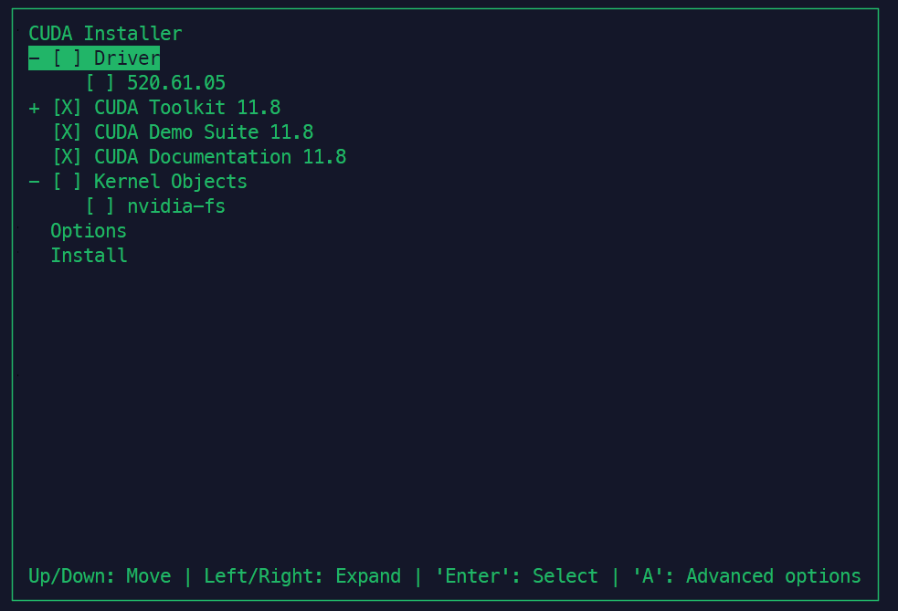

# 4주차

## 25.05.06


## 안면인식용 GPU 서버 세팅

계속 서버(디스플레이 파손된 NT800G5H)가 죽어서 오류 잡기 시도...

4일동안 우분투 OS 13번 재설치 하면서 낸 결론은 하드웨어 문제.

다른 기기에 설치 후 SSD 이식은 설치까지는 잘 되나, 이식 이후에 문제 발생. 다시 원래 기기로 옮기면 잘 작동. Desktop 버전이나 Server 버전이나 동일. 부팅부터 안되거나, 부팅은 되는데 동작하다 중간에 사망, 부팅하고 잘 동작하다가 apt-get upgrade 하다가 사망 등등... 여러 상황에서 서버가 죽는 문제 발생.

서버기기에서 직접 USB로 설치를 시도하면, Desktop의 경우 Try or Install 누르고 로딩 중에 그대로 프리징 걸려버림. Server로 설치할 경우 설치까지는 완료되나, 재부팅하면 부팅 중에 프리징.

여러 테스트를 거치면서 전원선으로 전원을 공급하면 문제가 발생할 확률이 10에 8,9 정도로 상당히 높은 것을 발견. 하지만 배터리로만 구동했을 때도 10에 2는 문제가 발생하였기에 정확한 원인은 파악하진 못하였음. 그동안 윈도우기반으로 서버 돌릴 때에는 문제가 없었던 것으로 볼 때, 아마 전원 연결 시에 리눅스 커널과 ACPI 또는 자체 전원 관리 쪽에서 충돌해서 문제가 생기는 것으로 결론 지음.

하여 다른 기기(주 사용 노트북)로 바꿔서 세팅하였음.

잘쓰던 윈도우 기반 서버에서 변경하는 사유는... 윈도우 업데이트.... 그리고 WSL2의 소소한 에러...


### 설치 및 세팅

Desktop 버전은 나중에 multi-user.target으로 CLI 환경으로 변경해줘야 하는 대신, 커널이 6.8 버전.

Server 버전은 처음부터 CLI 환경인 대신, 커널이 5.15 버전.


5.15 버전에서는 하드웨어 지원이 부족한 부분이 조금 있으므로 일단은 6.8 버전 사용

우분투 설치까지는 이전에 한 방식과 동일. Nvidia driver가 설치된 CLI 환경이라 가정하고 시작.


#### 1. CUDA

CUDA 12.1과 11.8을 사용하는 멀티 쿠다 환경을 구성할 것이기 때문에,
(동시 사용은 X. 심볼릭 링크 문제. 동시 사용하려면 도커 컨테이너로 사용.)

```bash
wget https://developer.download.nvidia.com/compute/cuda/12.1.1/local_installers/cuda_12.1.1_530.30.02_linux.run
sudo sh cuda_12.1.1_530.30.02_linux.run

wget https://developer.download.nvidia.com/compute/cuda/11.8.0/local_installers/cuda_11.8.0_520.61.05_linux.run
sudo sh cuda_11.8.0_520.61.05_linux.run
```

두 버전 모두 다운받아 설치해준다.

이 때, 드라이버는 설치하지 않는다. 드라이버까지 설치하게 되면 충돌이 발생.


드라이버 체크 해제 후 Install.



심볼릭 링크는 메인으로 사용할 버전이 오게 설정.

두 버전 모두 설치 끝났으면 CuDNN 설치.


#### 2. CuDNN

11.8에는 8.7.0 버전을, 12.1에는 9.1.1 버전을 넣어줄 건데, 8.X.X 버전은 다운로드에 로그인 필요하므로 윈도우기반 기기에서 다운로드 후 rsync나 ssh로 넣어주기.

8.7.0 버전 설치 (11.8 고정)

```bash
# 보내는 기기
rsync -avz -e "ssh -i ~/.ssh/id_rsa" ./cudnn-linux-x86_64-8.7.0.84_cuda11-archive.tar.xz <유저>@<호스트>:<저장할 위치(절대주소)>

# 받은 기기에서 압축풀고 적용, 권한 주기
tar -xvf cudnn-*-archive.tar.xz
sudo cp -a cudnn-*-archive/include/cudnn*.h /usr/local/cuda-11.8/include/
sudo cp -a cudnn-*-archive/lib/libcudnn* /usr/local/cuda-11.8/lib64/
sudo chmod a+r /usr/local/cuda-11.8/include/cudnn*.h /usr/local/cuda-11.8/lib64/libcudnn*

# cp -L : 링크 연결된 파일원본 가져와서 복사
# cp -P : 심볼릭 링크면 링크 자체 복사
# cp -a : 아카이브 모드로 구조, 권한, 링크 복사
```

9.1.1 버전 설치 (12.1 고정)

```bash
# 설치
wget https://developer.download.nvidia.com/compute/cudnn/9.1.1/local_installers/cudnn-local-repo-ubuntu2204-9.1.1_1.0-1_amd64.deb
sudo dpkg -i cudnn-local-repo-ubuntu2204-9.1.1_1.0-1_amd64.deb
sudo cp /var/cudnn-local-repo-ubuntu2204-9.1.1/cudnn-*-keyring.gpg /usr/share/keyrings/
sudo apt-get update
sudo apt-get -y install cudnn

# 적용, 권한 주기
sudo cp -a /usr/include/cudnn*.h /usr/local/cuda-12.1/include/
sudo cp -a /usr/lib/x86_64-linux-gnu/libcudnn* /usr/local/cuda-12.1/lib64/
sudo chmod a+r /usr/local/cuda-12.1/include/cudnn*.h /usr/local/cuda-12.1/lib64/libcudnn*
```


#### 3. CUDA 등록 및 버전 변경

```bash
nano ~/.bashrc  # .zshrc
```

```bash
# 맨 밑에 추가
# 쿠다 환경변수 기본값
export CUDA_HOME=/usr/local/cuda-12.1
export PATH=/usr/local/cuda-12.1/bin:$PATH
export LD_LIBRARY_PATH=/usr/local/cuda-12.1/lib64:$LD_LIBRARY_PATH
export CPATH=/usr/local/cuda-12.1/include:$CPATH

#cuda 버전 전환
alias cuda118='source ~/use_cuda.sh 11.8'
alias cuda121='source ~/use_cuda.sh 12.1'
```

```bash
source ~/.bashrc  # .zshrc

nano use_cuda.sh
```

```bash
#!/bin/bash
# 사용법: source ~/use_cuda.sh <쿠다 버전>

CUDA_VER=$1
CUDA_DIR="/usr/local/cuda-${CUDA_VER}"

if [ -z "$CUDA_VER" ]; then
  echo "CUDA 버전을 입력하세요. 예: source use_cuda.sh 12.1"
  return 1
fi

if [ ! -d "$CUDA_DIR" ]; then
  echo "CUDA 디렉터리가 없습니다: $CUDA_DIR"
  return 1
fi

# 심볼릭 링크 업데이트
sudo ln -sfn ${CUDA_DIR} /usr/local/cuda

# 환경변수 설정
export CUDA_HOME=${CUDA_DIR}
export PATH=${CUDA_HOME}/bin:$(echo "$PATH" | tr ':' '\n' | grep -v 'cuda' | paste -sd:)
export LD_LIBRARY_PATH=${CUDA_HOME}/lib64:$(echo "$LD_LIBRARY_PATH" | tr ':' '\n' | grep -v 'cuda' | paste -sd:)
export CPATH=${CUDA_HOME}/include:$(echo "$CPATH" | tr ':' '\n' | grep -v 'cuda' | paste -sd:)

echo "CUDA ${CUDA_VER} 환경 설정 완료"
```


#### 4. Docker nvidia-container-toolkit 설치

```bash
curl -fsSL https://nvidia.github.io/libnvidia-container/gpgkey | sudo gpg --dearmor -o /usr/share/keyrings/nvidia-container-toolkit-keyring.gpg \
  && curl -s -L https://nvidia.github.io/libnvidia-container/stable/deb/nvidia-container-toolkit.list | \
    sed 's#deb https://#deb [signed-by=/usr/share/keyrings/nvidia-container-toolkit-keyring.gpg] https://#g' | \
    sudo tee /etc/apt/sources.list.d/nvidia-container-toolkit.list

sudo apt-get update && sudo apt-get install -y nvidia-container-toolkit
```

설치 검증

```bash
$ nvidia-ctk --version
> NVIDIA Container Toolkit CLI version 1.17.6
```


#### 5. python 설치

```bash
sudo apt-get install python3 python3-pip python3-dev -y  # 3.10.12 설치됨
# python path 설정
sudo update-alternatives --install /usr/bin/python python /usr/bin/python3.10 1
# pip path 설정
sudo nano /etc/environment

# PATH 맨 앞에
PATH="<유저홈 절대경로>/.local/bin: ~~~ "

source /etc/environment
```


#### 6. Qdrant 세팅

Qdrant 가입 후 레포 만들어주고,

```bash
# Docker 사용하여 Qdrant 설치
docker run -d --name qdrant -p 6333:6333 -v $(pwd)/qdrant_storage:/qdrant/storage qdrant/qdrant
# python 클라이언트 설치
pip install qdrant-client
```

